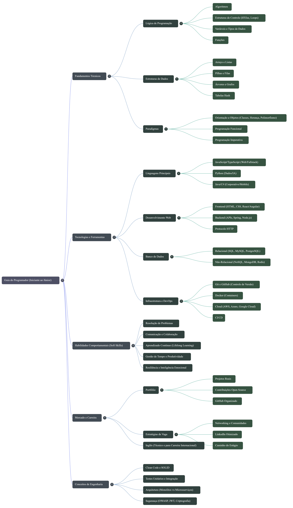

# Guia de Estudos para Programadores
Roadmap de estudos para programadores, com curadoria de conteúdos, engenharia de prompts e organização do conhecimento utilizando NotebookLM.

## 📌 Contexto e Objetivos

Este projeto foi desenvolvido como parte de um desafio da plataforma DIO (Digital Innovation One), com o objetivo de aliar pensamento crítico, curadoria de fontes e organização do conhecimento para criar um Caderno Temático no NotebookLM. Como tema escolhir organizar um plano de estudos estruturado para desenvolvedores iniciantes, reunindo os principais conhecimentos técnicos e práticos necessários para evoluir na área de programação.

## 🗺️ Roadmap de Estudos

## 📚 Curadoria de Fontes

- https://www.dio.me/articles/conceitos-essenciais-que-todo-programador-deveria-conhecer
- https://www.rocketseat.com.br/blog/artigos/post/habilidades-essenciais-para-ser-programador
- https://www.youtube.com/watch?v=iUpzVM4hX0A&t=9s
- https://www.youtube.com/watch?v=2c-LeVwCFe4&t=2s

## 🤖 Engenharia de Prompts e Cicatrizes
Principais Prompts utilizados para gerar um plano de estudos em programação.

- Monte um plano de estudos para programadores com foco em prática, incluindo projetos reais
- Qual o melhor caminho para conseguir a primeira oportunidade profissional?
- Quais projetos reais são bons para um portfólio júnior?
- Como a inteligência artificial impacta o mercado para novos programadores?

### ⚠️ Dificuldades Encontradas

- Algumas respostas da IA foram muito genéricas
- Dificuldade em filtrar conteúdos realmente relevantes
- Necessidade de refinar prompts para obter respostas mais práticas

### 🔄 Ajustes de Prompts

- Tornei os prompts mais específicos
- Passei a pedir exemplos práticos
- Solicitei respostas voltadas para iniciantes

## 📖 Miniguia de Estudo

#### 🧩 1. Fundamentos
- Lógica de programação
- Variáveis
- Condições (if/else)
- Loops (for/while)
- Funções
- Classes
- Objetos

#### 🧩 2. Estruturas de Dados
- Arrays
- Listas
- Tuplas
- Pilha e fila
- Grafos e Árvores
- Hash

#### 🧩 3. Backend
- HTTP (GET, POST, etc.)
- API
- CRUD
- Banco de dados
- ORM
- Tokens e JWT

#### 🧩 4. Frontend
- HTML
- CSS
- JavaScript
- Frameworks (ex: Angular)
- Bibliotecas (ex: React)

#### 🧩 5. Ferramentas
- Git e GitHub
- Terminal
- IDE (ex: VS Code)
- Postman / Insomnia
- DBeaver

#### 🧩 6. Projetos Práticos
- ToDo List
- Site
- API simples
- Sistema de login
- CRUD completo
- Aplicação de POO (Abstração, Encapsulamento, Herança e Polimorfismo)
- Modelagem de Banco de Dados Relacional

## 📚 Glossário
- POO → Programação Orientada a Objetos
- API → comunicação entre sistemas
- CRUD → Create, Read, Update, Delete
- Framework → estrutura pronta
- Biblioteca → coleção de códigos pré-escritos
- ORM → ferramenta que permite interagir com o banco de dados usando código, sem precisar escrever SQL diretamente.
- SDK → Kit de Desenvolvimento de Software
- DB → Banco de Dados

## 📌 Conclusão
- Aprendi a organizar melhor meus estudos
- Percebi a importância da prática
- Tive dificuldade em filtrar conteúdos
- Pretendo aprofundar em backend
- Novas ideias para projetos
